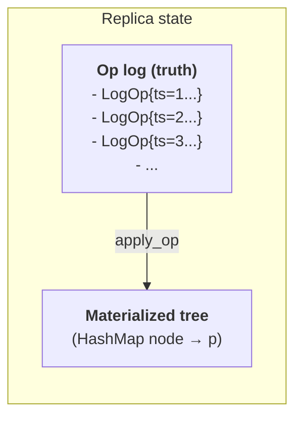

# Tree CRDT walkthrough

This is the deep-dive companion to [Sync, done right](sync.md).
The sync page argues *why*; this one walks through *how*, with code.

It specifies the tree CRDT used by `outl-core`: an op log of `Move` / `Edit` / `SetProp` / `Create` operations is replicated and converged across devices without coordination, without a server, and without ever corrupting the user's outline.

The algorithm is from:

> **Martin Kleppmann, Dominic P. Mulligan, Victor B. F. Gomes, Alastair R. Beresford.** *"A highly-available move operation for replicated trees."* IEEE Transactions on Parallel and Distributed Systems, 2022.
> <https://martin.kleppmann.com/papers/move-op.pdf>

Block-level text editing rides on **Yjs/Yrs**, which is itself a CRDT and needs no orchestration beyond delivering its binary updates to the right node.

---

## Why a tree CRDT is necessary

A naive replicated outline breaks in three ways:

1. **Text-level CRDTs (RGA, LSEQ, Y) don't model parent-child.** Edit the word "draft" inside a block: fine.
   Move the block to a different parent: the text CRDT has no opinion.
   Two devices doing concurrent moves can end up with the block having two parents, or zero parents, or in a cycle.

2. **List CRDTs (`Y.Array`, RGA) don't handle reparenting.** They give you convergence within a list, but the user's outline isn't one list — it's nested lists.

3. **Git merge destroys outline structure.** Concurrent edits to the same line collide.
   The user does a manual merge and the IDs are gone, the structure is mangled, or both.
   We don't ship that to users.

A tree CRDT specifically tracks the **parent of each node** as part of the replicated state.
Concurrent moves of the same node converge by op ordering.
Concurrent moves that would create a cycle are detected and the loser becomes a no-op deterministically.

---

## State model

Each replica holds two things:

1. **Op log** — append-only, totally ordered by HLC `(timestamp, actor)`.
2. **Materialized tree** — derived from the log via `apply_op`.



The tree is **derivable** from the log.
It exists for fast reads but is never authoritative.
A corrupted tree is rebuilt by replaying the log.

---

## Op types

```rust
enum Op {
    Move {
        node: NodeId,
        new_parent: NodeId,
        position: Fractional,
        // Populated by do_op; needed for undo.
        old_parent: NodeId,
        old_position: Fractional,
    },
    Edit {
        node: NodeId,
        text_op: YrsUpdate,  // binary delta from Yrs
    },
    SetProp {
        node: NodeId,
        key: String,
        value: Option<PropValue>,  // None = remove
        old_value: Option<PropValue>,
    },
    Create {
        node: NodeId,
        parent: NodeId,
        position: Fractional,
        // No `old_*` field. `Create` is idempotent, so its undo record is
        // "did this op insert the node?" — kept in `Tree::created_by`
        // rather than on the wire. See RFC 0263.
    },
    SetCollapsed {
        node: NodeId,
        value: bool,
        // Populated by do_op; needed for undo.
        old_value: bool,
    },
}

struct LogOp {
    ts: HLC,
    actor: ActorId,
    op: Op,
}
```

The `old_*` fields are **not** filled in by the producer.
They are populated by `do_op` at the moment the op is applied, so `undo_op` can later revert exactly to the pre-op state.

**`Delete` is intentionally not an op.** Deleting node `N` is `Move(N, TRASH_ROOT)`.
This simplifies the algorithm — concurrent edit + delete becomes concurrent edit + move — and preserves the deleted subtree for history/undo.

**`SetCollapsed` carries UI fold state through the op log.** The flag controls whether a block renders with its children hidden in the outline view — presentation state, but globally meaningful across devices.
Routing it through an `Op` (rather than a sidecar field) is what gives concurrent flips a real merge semantics: each device appends to its own `ops-<actor>.jsonl`, HLC + actor tiebreak resolves any timing collision deterministically, and idempotent re-apply of the same `LogOp` is a no-op.
This is the canonical pattern for any future per-block UI state that must converge — pin status, custom colour, whatever.
The sidecar carries only structural matching metadata; sync state belongs on the op log.

---

## HLC timestamps

We use **Hybrid Logical Clocks**, hand-rolled in `crates/outl-core/src/hlc.rs`.

```
HLC = (physical_ms: u64, logical_counter: u32, actor: ActorId)
```

Comparison is lexicographic: physical first, then logical, then actor as final tiebreak.
This gives a **total order** without coordination.

**Why actor is tiebreak, not random**: when two replicas pick the same `(physical, logical)` (clock skew, very busy moment), the actor ID — a ULID fixed per device — breaks the tie deterministically.
Both replicas agree on the same winner without talking to each other.

### What the generator does and does not promise

This page said "via the `uhlc` crate" for a long time.
It is not true and was never true: `uhlc` appears in no manifest in the repo.
The substitution was not a decision anyone made — the docs simply described a dependency that was never added — so the properties `uhlc` would have brought have to be checked against the code rather than assumed.

What holds:

- The total order above.
  `(physical_ms, logical, actor)` compared lexicographically, actor last, is exactly what convergence needs and it is what `Hlc`'s `Ord` does.
- `HlcGenerator::next` is monotonic **against its own in-memory state**.
  A wall clock that jumps backwards does not produce a duplicate or a rewind: `physical_ms` stays put and `logical` increments.
- `observe(remote)` folds a remote timestamp in correctly, so a local op issued after observing a peer sorts after it.
  It has exactly one caller in the whole repo (in `outl-plugins`), so most ops never go through it.

What does **not** hold, and the difference matters when reading the rest of this page:

- **There is no drift clamp on the ops themselves.**
  `uhlc` bounds how far a physical component may run ahead of local time and rejects a remote timestamp beyond that; nothing here does.
  A device with a badly wrong clock stamps ops with its wrong time and every peer accepts them.
  `outl-sync-iroh` drops an incoming op more than `MAX_CLOCK_SKEW_MS` (24h) ahead on ingest, but the file transports never pass through that gate.

What changed, and is now true:

- **The generator is seeded from the op log at boot.**
  `Workspace::seed_clock` raises it to the maximum HLC across every actor, so a backwards wall-clock jump no longer produces a locally-minted op that sorts below the log's tail.
  This was a cost, not a convergence bug: `apply_op` exists to absorb an op arriving below the tail, so a low-stamped op was reordered into place and every replica still landed on the same tree.
  What it cost was the `debug_assert` in `OpLog::append` and the paper's undo/redo window over every newer entry, roughly 74 ms for one late op on a 217k-op log, paid on a foreground keystroke.
  A real workspace carried 11 such rollback events, the widest 2.7 days.

- **The seed has a ceiling, and the ceiling is `now + 24h`.**
  Seeding folds *every* actor's maximum into this device's generator, and the seeded value is then stamped onto this device's own ops and appended to `ops-<own>.jsonl`, where the next boot reads it back.
  Without a ceiling, one corrupt or hostile far-future `physical_ms` is absorbed on the first boot that sees it and pins the local clock in the future permanently, irreversibly for that workspace.
  `outl_core::hlc::MAX_CLOCK_SKEW_MS` is the single owner of that window, the same 24h `outl-sync-iroh` uses on ingest, declared in `outl-core` because the transport depends on the kernel and not the reverse.
  Clamping only *lowers* how far the clock is raised, and both `seed` and `next` are monotone against the generator's own state, so it can never rewind a clock or issue a duplicate.
  The worst it can do is leave one workspace in the pre-seeding world, which is a reorder cost and never a divergence.

- **The logical counter carries, it does not saturate.**
  While `logical` could only grow inside a single wall-clock millisecond, `u32::MAX` was unreachable and a saturating bump was harmless.
  Seeding made it reachable, because the counter is now raised from a `u32` read off disk.
  Pinned at the ceiling with `physical_ms` at or ahead of the wall clock, `next()` would return the same `Hlc` forever, and `Workspace::apply` would dedup every subsequent local op by `ts` and return `Ok(())` without persisting: silent, total write loss reported as success.
  `(p, u32::MAX)` now carries to `(p + 1, 0)`, which sorts strictly after it.

---

## Fractional indexing

Sibling order uses a **fractional index** — a lexicographically sortable string position.

```
inserting between "a1" and "a2" → "a1V"
inserting between "a1V" and "a2" → "a1k"
inserting at the start → ""+key < "a1"
```

`Move` only changes the position of the moved node.
Siblings keep their fractional indices unchanged.
Concurrent inserts at the same gap resolve by HLC tiebreak: both succeed, the one with the higher HLC sorts after.

Implementation: ~100 lines, or use the `fractional_index` crate.

---

## `do_op`

```
do_op(op):
    match op:
        Move { node, new_parent, position, old_parent, old_position }:
            // 1. Capture pre-state on the LogOp for undo.
            log_op.op.old_parent   = tree.parent(node)
            log_op.op.old_position = tree.position(node)

            // 2. Check for cycle (NB: ancestor check is transitive).
            if creates_cycle(node, new_parent):
                // NO-OP on tree. LogOp still gets appended.
                return

            // 3. Apply.
            tree.set_parent(node, new_parent, position)

        Edit { node, text_op }:
            if tree.contains(node):
                tree.block_content_mut(node).apply_yrs_update(text_op)
            // If the node is in TRASH_ROOT, the edit applies to the Yrs doc
            // but the user won't see it. That's fine — semantics preserved.

        SetProp { node, key, value, old_value }:
            log_op.op.old_value = tree.property(node, key)
            tree.set_property(node, key, value)

        Create { node, parent, position }:
            // Idempotent: if node already in tree, no-op.
            // Cycle guard, exactly like Move: under reordering a Create can
            // arrive after a Move already parented something under `node`, so
            // `parent` may already be a descendant of `node`. Creating the edge
            // would close a loop, so it's a NO-OP on the tree (LogOp still gets
            // appended).
            //
            // Record whether THIS op is the one that materialized the node —
            // the paper's `oldp` (see undo_op below). Computed before the
            // branch that may skip, so a replay cannot read a stale value.
            created_here = not tree.contains(node)
            if created_here and not creates_cycle(node, parent):
                tree.create(node, parent, position)
                tree.created_by[node] = log_op.ts
```

The materializing effect of `do_op` is **observable**.
The `LogOp` mutation (filling in `old_*`) is bookkeeping that makes `undo_op` possible.

### `creates_cycle`

```
creates_cycle(node, new_parent):
    if new_parent == node:
        return true
    // Walk up from new_parent toward root; if we hit `node`, it's a cycle.
    p = new_parent
    while p is not ROOT and p is not TRASH_ROOT:
        if p == node:
            return true
        p = tree.parent(p)
    return false
```

The naive check `tree.parent(node) == new_parent` is **wrong**.
A correct check is transitive.
Failing this gives you the bug from `cycle_chain.rs`.

---

## `undo_op`

```
undo_op(log_op):
    match log_op.op:
        Move { node, old_parent, old_position, ... }:
            // Note: undo a cycle-no-op move is also a no-op (tree wasn't changed).
            // We detect that by checking if current parent matches the move's
            // new_parent — if it doesn't, the move was a no-op, skip undo.
            if tree.parent(node) == log_op.op.new_parent:
                tree.set_parent(node, old_parent, old_position)

        Edit { node, text_op }:
            // Yrs supports applying an inverse update. We store the original
            // state ref ID and undo via Yrs's undo manager if available, or
            // skip — Yrs already converges, so undo here is partial.
            // (See Yrs section below.)

        SetProp { node, key, old_value, .. }:
            tree.set_property(node, key, old_value)

        Create { node, .. }:
            // Only if THIS Create is the one that materialized the node.
            // `do_op(Create)` is idempotent, so a Create that found the node
            // already there changed nothing and its inverse is the identity.
            // Removing unconditionally deletes a node somebody else's Create
            // made — and duplicate Creates are routine, because page roots
            // are addressed by the deterministic `NodeId::from_slug`.
            if tree.created_by[node] == log_op.ts:
                tree.remove(node)
```

Undo precondition: the op was previously applied via `do_op`.
Calling `undo_op` on something that was never `do_op`'d is undefined — but `apply_op` is responsible for only undoing things that were applied.

### `undo_op` must be the exact inverse of `do_op` — for *every* op

Including the ones `do_op` turned into no-ops.
This is not a style rule; it is the hinge of the correctness argument.
In the authors' Isabelle development it is the lemma `do_undo_op_inv` (`proof/Move.thy`), whose **only** hypothesis is that the tree is well-formed — there is no case split on whether the op had an effect — and it is invoked inside the commutativity proof that discharges `theorem apply_ops_commutes` (paper §4.2), which is what plugs the algorithm into Gomes et al.'s SEC framework.

Every variant therefore records what `do_op` found, not what it did:

| variant | where the record lives |
|---|---|
| `Move` | `old_parent` / `old_position` fields, plus the `parent == new_parent` guard in `undo_op` |
| `SetProp` | `old_value` field |
| `SetCollapsed` | `old_value` field |
| `SnoozeRemind` | `old_until_ms` field |
| `Create` | `Tree::created_by`, a `node → Hlc` side table — *not* a field |
| `Edit` | nothing: a tree-level no-op on both sides, symmetric by construction |

`Create` is the odd one out because it has no field for it, and adding one would put undo-only local derivation on the sync surface for the most frequent op in the log — the mistake `Op::Move::old_parent` already made.
In the paper that record is not on the transmitted operation either: `Move t p m c` carries four fields and `oldp` lives on the local `LogMove` log record (§3.2).
`created_by` keeps `Create`'s answer on the side the paper keeps it.

This asymmetry was a real, convergence-breaking bug: [RFC 0263](rfcs/0263-create-is-invertible.md).

---

## `apply_op`

```
apply_op(new_op):
    if log.empty() or new_op.ts > log.last().ts:
        do_op(new_op)
        log.append(new_op)
    else:
        // Reorder: pop newer ops from the log, undo each, then redo in order.
        undone = []
        while not log.empty() and log.last().ts > new_op.ts:
            op = log.pop()
            undo_op(op)
            undone.push(op)

        do_op(new_op)
        log.append(new_op)

        // Replay undone ops in their original order.
        for op in undone.reverse():
            do_op(op)
            log.append(op)
```

Idempotency check is implicit: if `new_op.ts` already exists in the log with the same actor, the function is a no-op (or we check explicitly to skip).
Implementation note: keeping the log sorted by `(ts, actor)` makes the lookup `O(log n)` via binary search.

### How often the undo/replay window is non-empty, measured

Almost never, locally.
On a real 217,811-op log the window is **0 for 217,663 of 217,663 ops**: every local path feeds `apply_op` already sorted, so a full replay undoes nothing at all.
Tree depth on the same workspace is p50=3, max=8.

Two consequences, and they pull in opposite directions:

- **There is no reorder-performance problem to solve.**
  The loop looks expensive and is not entered.
  An optimization aimed at shrinking the window has nothing to shrink — this was proposed and refuted by the measurement above.
- **`undo_op`'s correctness is not made less important by that number.**
  The window is non-empty exactly when an op arrives from *another device* below the local tail, which is the whole point of the algorithm and the case a single-device replay can never exercise.
  A defect in `undo_op` is therefore invisible to every local test that replays an ordered log, and shows up only once a workspace has two devices — which is how [RFC 0263](rfcs/0263-create-is-invertible.md) survived undetected.

---

## The cycle case (worked example)

The textbook concurrent-move conflict:

**Initial state**:
```
ROOT
├── X
│   └── A
└── Y
    └── B
```

**Device 1** (online, time t=10): `Move(A, B)`.

After applying:
```
ROOT
├── X (empty)
└── Y
    └── B
        └── A
```

**Device 2** (offline, time t=12): `Move(B, A)`.

After applying locally:
```
ROOT
├── X
│   └── A
│       └── B
└── Y (empty)
```

Now devices reconnect.

**Device 1 receives** `Move(B, A)` with ts=12:
- ts=12 > last ts in log (ts=10).
  Append.
- `do_op(Move(B, A))`:
  - `creates_cycle(B, A)`?
    Walk up from A: A → B → ROOT.
    Hit B. **Yes, cycle.**
  - No-op on the tree.
    But `LogOp` still appended.
- Device 1 final tree: same as before.

**Device 2 receives** `Move(A, B)` with ts=10:
- ts=10 < last ts (ts=12).
  Reorder!
- Pop `Move(B, A)` from log, `undo_op` → tree reverts to initial.
- `do_op(Move(A, B))`:
  - `creates_cycle(A, B)`?
    Walk up from B: B → Y → ROOT.
    No cycle.
  - Apply.
    Tree: A is child of B, X is empty.
- Push `Move(A, B)` to log.
- Replay undone: `do_op(Move(B, A))`:
  - `creates_cycle(B, A)`?
    Walk up from A: A → B → Y → ROOT.
    Hit B. **Yes, cycle.**
  - No-op on the tree.
- Device 2 final tree:
```
ROOT
├── X (empty)
└── Y
    └── B
        └── A
```

**Both devices converged to the same tree.** And `Move(B, A)` is still in the log on both devices, ready to become non-cyclic if some future op re-arranges B and A.

---

## Yrs integration (block content)

A block's textual content is a Yrs `TextRef` inside a per-block `Doc`.
Edits to a block produce binary update bytes via `Doc::encode_state_as_update_v1`.

When a `Edit` op arrives:

1. Decode the binary update.
2. Find the block's `Doc` (creating one if it doesn't exist — content of a never-seen block is replayed from the update).
3. `Doc::apply_update(update)`.

Yrs is itself a CRDT, so block content convergence is guaranteed by Yrs.
Our job is just to deliver the right update to the right node.

**Note on undo for `Edit`**: Yrs has an `UndoManager`, but its semantics don't perfectly align with our tree-level undo.
For now we accept that undoing an `Edit` may be partial (the materialized text on undo may include parts of the edit that interleave with concurrent edits).
This is **safe** — Yrs guarantees convergence — but it's worth documenting that user-facing "undo" in the TUI cannot rely on `undo_op` for text.

---

## The five formal invariants

The algorithm in this document is meant to satisfy:

### 1. Convergence (Strong Eventual Consistency)

For any two replicas R₁, R₂ that have observed the same set of ops S:
```
materialized_tree(R₁) == materialized_tree(R₂)
```

Test: `tests/convergence.rs` — three replicas apply ops in different permutations, all materialize the same tree.

### 2. Commutativity after reordering

`apply_op` is **commutative** in the sense that the final state depends only on the set of ops, not the order they were delivered.
Reordering is handled internally via undo/replay.

Test: `tests/property_based.rs` with proptest.

### 3. Idempotency

```
apply_op(op); apply_op(op) ≡ apply_op(op)
```

Test: `tests/idempotency.rs`.

### 4. Tree invariant preservation

After any number of `apply_op` calls, the materialized tree is a valid tree:

- No node has two parents.
- No cycle exists.
- Every node is reachable from `ROOT` or `TRASH_ROOT`.

Test: `tests/cycle.rs`, `tests/cycle_chain.rs`, plus invariant assertion in property tests.

### 5. No silent loss

Every op delivered to `apply_op` ends up in `log` (modulo idempotent dedup).
This includes:

- Ops that are no-ops on the materialized tree (cycle detection)
- Ops that arrived out of order (always appended after reorder)
- Ops on nodes in `TRASH_ROOT` (still recorded)

Test: assertions in every CRDT test that `log.len()` grows monotonically with applied unique ops.

---

## Test battery

Mandatory tests in `crates/outl-core/tests/`:

| File | Tests |
|------|-------|
| `convergence.rs` | 3 replicas, 100+ random ops in different orders → same final state |
| `cycle.rs` | A↔B classic case |
| `cycle_chain.rs` | A→B→C with concurrent C→A; transitive ancestor check |
| `concurrent_edit_move.rs` | Block edited and moved simultaneously |
| `concurrent_delete_edit.rs` | Move-to-trash wins, edit recorded |
| `late_op.rs` | Op with old ts forces reorder |
| `idempotency.rs` | apply N times == apply 1 time |
| `fractional_index.rs` | Concurrent inserts at same gap converge |
| `large_log.rs` | 10k ops stress, asserts < 1s materialization |
| `property_based.rs` | proptest, generates random op sequences |
| `convergence_property.rs` | the five convergence properties (below), over the generator in `convergence_gen/` |
| `create_tree_invariants.rs` | deterministic `Op::Create` regressions: the cycle guard, the phantom parent |
| `create_undo_symmetry.rs` | `undo_op` is the exact inverse of `do_op`, for every variant ([RFC 0263](rfcs/0263-create-is-invertible.md)) |
| `create_undo_after_snapshot_boot.rs` | `Create`'s undo record is rebuilt correctly when boot came from a snapshot |

Coverage target:

- **`tree::do_op`, `tree::undo_op`, `tree::apply_op`, `tree::creates_cycle`: 100%**
- **`outl-core` overall: > 90%**

---

## What this algorithm does NOT solve

Be honest about the limits:

- **No fine-grained block-level merge of moves.** If both replicas move the same node concurrently, one move wins (by HLC).
  The losing replica's user may briefly see a different position, but after sync everyone agrees.
  This is *the right thing* — pretending both moves "succeed" loses information.

- **No application-level conflict notification.** outl converges silently.
  A future feature could surface "concurrent edits to this block" in the UI.
  Not yet.

- **No causal delivery enforcement.** We rely on HLC ordering, not vector clocks.
  The algorithm is correct under any delivery order (that's the point of `apply_op` doing undo/replay), but it's worth noting we don't need causal channels.

- **Yrs `Edit` undo is best-effort.** As noted above, undoing a text edit via `undo_op` may not reverse the user-visible string exactly when there are interleaved concurrent edits.
  The string state still converges; only undo semantics weaken.

---

## References

- Paper: <https://martin.kleppmann.com/papers/move-op.pdf>
- OCaml reference impl: <https://github.com/martinkl/crdt-tree-move>
- Kleppmann's talk: "CRDTs: The Hard Parts" (Strange Loop 2020)
- Yrs: <https://github.com/y-crdt/y-crdt>
- Yjs docs: <https://docs.yjs.dev/>
- Author write-ups on the outl implementation:
  - [From paper to outliner](https://avelino.run/from-paper-to-outliner/) — the gap between the paper's convergence proof and a shipped app (projections, reconciliation, transport edge cases).
  - [File sync isn't trivial](https://avelino.run/file-sync-isnt-trivial/) — why concurrent file moves are a distributed-systems problem, framed for engineers who haven't read the paper yet.

---

## Convergence property suite

Moved here from `crates/outl-core/CLAUDE.md` (issue #216). The suite is what proves the paper's convergence claim holds in this implementation, so it belongs next to the algorithm it verifies rather than in a file loaded on every edit to the crate.

It is three files, not one: the original reached 838 lines against a 900-line hard stop, so it was split before it got there.
`convergence_gen/` owns the generator and the comparison helpers (**single owner** — a second `lower()` would let the callers disagree about what a generated program is);
`convergence_property.rs` holds the five properties, and keeps the `.proptest-regressions` seeds that name them;
`create_tree_invariants.rs` holds the two deterministic `Op::Create` regressions the suite surfaced.
No test was renamed in the split.

The definitive guard for the SEC claim.
It generates bounded random op programs across up to 4 actors with globally-unique, monotonic-per-actor HLCs.
The op mix is `Create` / `Move` / delete=`Move`→trash / `SetProp` / `SetCollapsed` / `SnoozeRemind`, and it includes **duplicate `Create`s for one node** — see the regression note below.
It delivers them to multiple replicas under random permutations and random duplication.
Every op carries a unique HLC so the idempotency dedup never silently drops two distinct ops.
The comparison is a `BTree`-keyed snapshot of the **full** materialized state: node parent+position, every property binding (via `Tree::iter_properties`, so a binding left on a node no longer in the tree is visible too), the collapsed set and the snooze table.
That is stronger than `common::assert_trees_equal`, which compares nodes only.
It is deterministic (no wall clock; permutations driven by seeded xorshift) and shrinks to a minimal counterexample on failure.

Properties and the invariants (above) they guard:

1. `convergence_under_reordering` — SEC + commutativity under any permutation, not just reverse.
2. `idempotent_under_duplication` — idempotency: 1–3× redelivery == once.
3. `concurrent_moves_never_cycle` — tree invariant + no silent loss.
   Concurrent cycle-forming moves never materialize a cycle, the no-op move still lives in every replica's log, and all replicas converge.
4. `hlc_actor_tiebreak_is_deterministic` — equal physical+logical, different actor resolves to the same winner on every replica.
5. `late_op_undo_redo_round_trips` — the `undo_op`→`do_op` reorder path is a faithful round-trip (a late op forces a full undo/redo of the log).

### The second generator, and the measurement that justifies it

`program_strategy()` above is deliberately broad, and that breadth has a measured cost: **it almost never fires the cycle guard.**

The measurement replays each generated program in HLC order, asking `Tree::creates_cycle` *before* each apply.
That separates a genuine rejection from a `Move` merely superseded by a later one — a distinction the first attempt at this measurement missed, reporting a meaningless 55%.
The corrected figure is **1.45% of structural ops rejected, and only 53 of 400 programs containing any rejection at all.**
So roughly 87% of the broad suite's cases never exercise invariant 4's "no-op on the tree, still in the log" clause.
Delete a cycle-rejected op from the log and most generated cases would not notice.

The cause is structural, not a weight to tune: a cycle needs `node` to be an **ancestor** of `new_parent`, and these programs materialize a mean of 2.39 live nodes at mean depth 1.33.
There is almost no ancestry to collide with.

So `cycle_dense_program_strategy()` is a **second** generator rather than a reshaping of the first — a deterministic 5-node chain prelude (so `i < j` implies ancestor) plus a body whose moves target `(n + offset) % 5`.
It reaches **22.41% of structural ops rejected, in 95.5% of programs**, at mean depth 2.35.
Crucially the rejections are *transitive* — an ancestor moved under its own descendant several levels down — so the full `creates_cycle` walk runs rather than only the immediate-parent case.

Reshaping the shared generator instead was rejected for a reason worth recording.
`convergence_property.proptest-regressions` holds seeds that replay through the *current* strategy, so changing its composition makes saved seeds decode to different programs.
That trades coverage of known past failures for coverage of a new path.
Both generators share one `lower()`, keeping the single-owner rule.

Four further properties run on it:

6. `convergence_holds_when_the_cycle_guard_rejects_often` — property 1, over dense programs.
7. `a_move_the_guard_rejected_is_redone_faithfully_after_a_late_op` — property 5 with a late op that is itself likely a cycle.
   This is the one that actually pins invariant 4's second clause, because `undo_op(Move)` reverts only when `parent(node) == new_parent` — which is exactly how it tells a move that took effect from one the guard rejected.
8. `duplicating_a_rejected_move_leaves_the_tree_and_the_log_alone` — property 2 over dense programs.
   A dedup keyed on *effect* ("this op did nothing, drop it") passes property 2 and fails this one.
9. `the_cycle_dense_generator_rejects_far_more_moves_than_the_shared_one` — the coverage claim itself, made fail-able.
   Absolute floors (≥15% of structural ops, ≥90% of programs) plus a ≥5× ratio, because the shared rate samples at 2.4–3.4% and a bare ratio would flip on noise.

### Regression: `Op::Create` honors the cycle guard

`Op::Create` runs `creates_cycle` before inserting, exactly like `Op::Move`.
This was a real bug the convergence suite surfaced.
The `Op::Create` branch used to do a bare `entry().or_insert((parent, pos))` with no cycle check.
So a `Create(node, parent)` whose `parent` was already a descendant of `node` inserted `node → parent` and closed a loop (a prior `Move` re-parents something under `node` under reordering).
That violates invariant #4 and then panics `creates_cycle` on the malformed tree.
A cycle-forming `Create` is now a no-op on the materialized tree (the op still goes into the log).
A cycle-skipped `Create` leaves `node` absent, and `undo_op` removes nothing for it — `Create`'s undo record (`Tree::created_by`) only names the op that actually inserted.
The deterministic regression is `create_respects_cycle_guard` (asserts no cycle, C stays unmaterialized, all ops logged, across every delivery order); the full-surface `convergence_under_reordering` property exercises it under random programs.

### Regression: the generator emits duplicate `Create`s, and varies positions

Two restrictions in `lower()` hid a convergence bug for as long as they stood ([RFC 0263](rfcs/0263-create-is-invertible.md)).

**A second `Create` for a node used to be lowered to a `Move`**, on the reasoning that a duplicate `Create` "is NOT a well-formed CRDT input" because "the surviving placement would depend on which Create arrived first".
Both halves are wrong.
Which `Create` arrives first is exactly what must *not* matter — the lowest-HLC one wins, and that is a property of the op *set*, not of delivery order.
And the shape is not exotic: page and journal roots are addressed by the deterministic `NodeId::from_slug`, so two devices opening the same journal offline each emit a `Create` for one node id.
Excluding it did not make it well-formed; it made it untested.

**Every op used to lower to the same position, `Fractional::parse("m")`.**
That made sibling position unobservable: a replica could place a node at the wrong op's position and still compare equal.
It is the class of divergence a broken `undo_op` produces — the node survives, at the placement of the wrong op — so the constant blinded the suite to the very thing it was meant to catch.
Positions now vary per step (`a..z`).

Reverting the one-line guard in `undo_op(Create)` fails three of the five properties, shrinking to a two-op `Create, Create` program.
