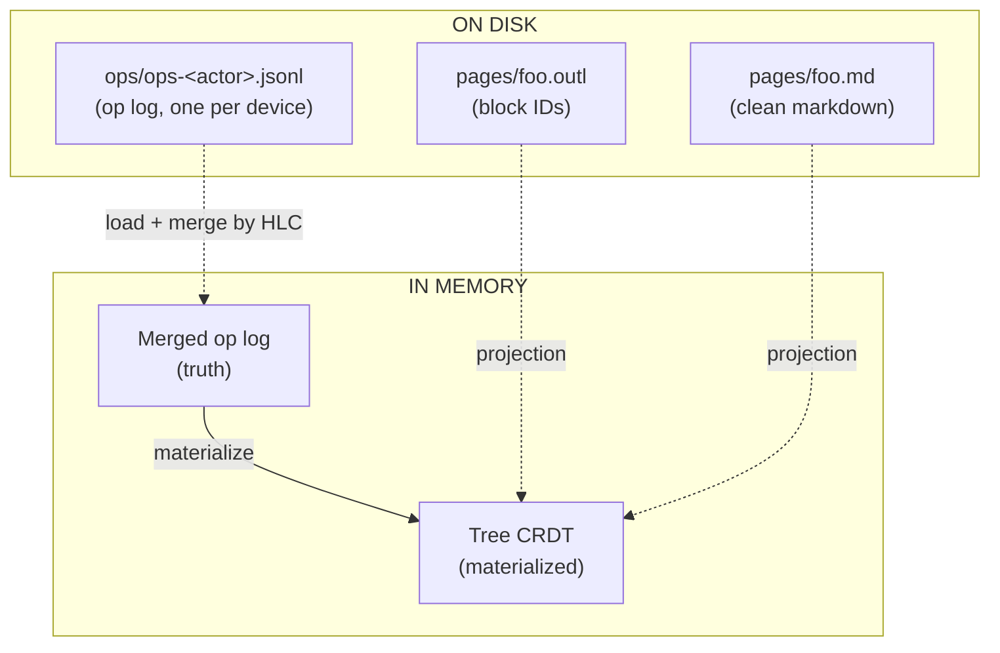
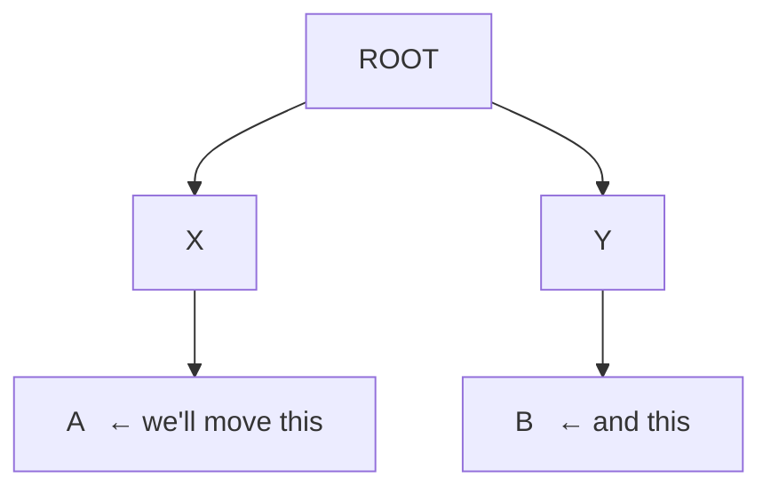
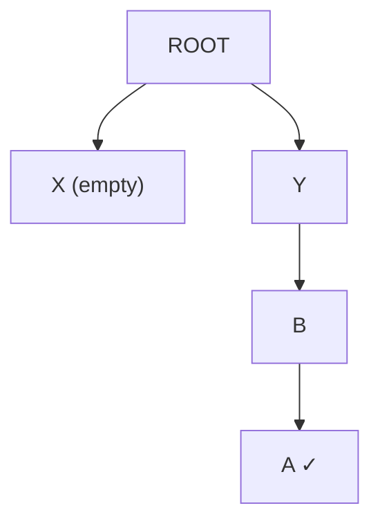
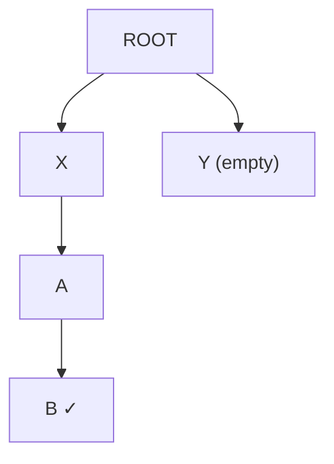

# Sync, done right

This page is the long version.
The pitch in one sentence: **outl is the only outliner whose sync is provably correct, doesn't need a server, and doesn't pollute your markdown to do it.**

If you want the algorithm walked through with code, jump to the [Tree CRDT walkthrough](crdt.md).
This page is about *why* — what breaks in the other tools, what's running in production today, and what's still ahead before we call this "state of the art".

The doc is split in two:

- **[Part 1 — What's in production today](#part-1--whats-in-production-today)** is the design that ships now.
  Tree CRDT core, op log on disk, the `SyncTransport` abstraction with **both** the file transport (iCloud Drive / shared filesystem) and the iroh P2P transport behind it.
  Plus the shared `SyncEngine`, the `outl peer` pairing flow, and what we explicitly trade off to get here.
- **[Part 2 — What's still ahead](#part-2--whats-still-ahead)** is the designed-but-not-built work.
  Per-page op log shards for 10k+ pages, per-page snapshots, signed ops, iroh-blobs snapshot transfer, and the migration path from today's layout to that one.

> **Companion read:** [File sync isn't trivial][avelino-file-sync] — a long-form post on *why* the problem is hard before this doc shows *how* outl solves it.
> Same author, written as the project was being built.

[avelino-file-sync]: https://avelino.run/file-sync-isnt-trivial/

---

# Part 1 — What's in production today

## Where the alternatives break

Both Roam and Logseq got the outliner UX right.
Both fall apart on sync.

### Roam Research — sync as a service

Roam keeps every workspace in a central database on their servers.
Real-time sync is great when it works.
The cost:

- **Your data lives on their machines.**
  Export is JSON; the moment Roam decides to throttle, raise prices, or shut down, your notes are stranded.
- **No offline merge.**
  Two devices edit the same block while disconnected?
  The one that connects last wins, the other one's changes silently vanish.
  There's no conflict surfaced, no merge prompt, no history of what was lost.
- **No interop.**
  You can't open a Roam graph in another editor.
  There's no `.md` on disk to inspect.

Roam was an inspiration for what an outliner *feels* like.
It is not an example of how to store your thinking.

### Logseq — files on disk, but the merge is hopeful

Logseq fixed the "where do my files live" problem: it writes markdown.
Then it broke the markdown:

```markdown
- ## My block
  id:: 6601a2c1-4f31-4a45-1c2c-3a5e6b7d8f90
  - child block
    id:: 6601a2c1-...
```

Every block gets a UUID written *into the file*.
Open it in VS Code, Obsidian, or `cat`, and it's full of metadata.
Worse:

- **Sync is a paid Pro tier.**
  And it's a file-rsync flavor — there is no merge algorithm.
  When two devices write the same file, the newer one wins.
  Same loss as Roam, just with extra steps.
- **DB version split the community.**
  Logseq's pivot to a database backend left the file-based users behind and shipped half-broken for over a year.
- **Mobile is a known-bad experience.**
  Years of users asking for parity.

Logseq pointed at the right idea — files on disk — and stopped halfway.

### Plain Git — the merge destroys structure

If files are markdown and you want sync, why not just `git`?

```bash
git pull --rebase
# CONFLICT (content): Merge conflict in pages/Avelino.md
```

Git treats the file as a sequence of *lines*.
When two people re-arrange the outline, the lines line up wrong, the merge marker splits a block in half, and you spend an hour resolving conflicts by hand.
Every move operation in a tree of nested bullets becomes a textual war.

Try it once.
You'll never do it twice.

---

## The architecture: op log + projections

The core idea is two layers:



1. **The op log is the source of truth.**
   Every change to the tree — moving a block, editing its text, setting a property, deleting — is recorded as a `LogOp` with a [Hybrid Logical Clock][hlc] timestamp.
   The list of ops, sorted by HLC, deterministically produces the tree.

2. **The materialized tree and the `.md` are projections.**
   Both can be thrown away.
   If your sidecar is lost, `outl doctor --repair` regenerates it from the op log.
   If your `.md` is deleted, the op log still has every block.

3. **Markdown on disk is *clean*.**
   No `id::`, no HTML comments, no YAML frontmatter delimiters.
   Block IDs live in `pages/foo.outl` (JSON, next to the `.md`, not dotted — iCloud Documents skips dotted paths when syncing across devices).
   When you edit `pages/foo.md` externally, outl's [3-level matching algorithm][matching] reconstructs which block had which ID.

[hlc]: https://cse.buffalo.edu/tech-reports/2014-04.pdf
[matching]: markdown-format.md

The pieces that make this work:

| Piece | What it does |
|-------|--------------|
| **Tree CRDT** ([Kleppmann et al. 2022][paper]) | Every device applies ops in HLC order, undoes/replays late arrivals, and provably converges to the same tree. |
| **HLC timestamps** | Total order across devices without coordination. Wall clock + logical counter + actor ID. |
| **Yrs (Yjs in Rust)** | Character-level CRDT for the text *inside* a block. Concurrent edits to the same sentence merge cleanly. |
| **Fractional indexing** | Sibling order as a sortable string. Inserting between two positions doesn't renumber anyone. |
| **Slugified filenames** | `[[Avelino]]` resolves to `pages/avelino.md` with `title:: Avelino` set automatically. The display name stays human; the filename is stable. |

[paper]: https://martin.kleppmann.com/papers/move-op.pdf

---

## Five formal guarantees the CRDT provides

It's worth being specific.
The algorithm in outl provides these:

### 1. Strong eventual consistency

Two devices that have observed the same set of ops produce *exactly* the same tree, regardless of delivery order or duplication.

Tested via `convergence.rs`: three replicas apply 100+ ops in three different permutations and the resulting trees are byte-identical.

### 2. Commutativity after reordering

The order in which a replica *receives* ops doesn't matter.
Internally the algorithm undoes newer ops, applies the late arrival in HLC position, then replays the undone ones.
The user-visible state is the same as if everything had arrived in HLC order from the start.

### 3. Idempotency

Applying the same op N times is the same as applying it once.
You can re-sync a workspace that's already in sync and nothing changes.
Tested in `idempotency.rs`.

### 4. Tree invariant preservation

The materialized tree is always a valid tree.
No node ever has two parents.
No cycle ever forms.
Every node is reachable from `ROOT` or the soft-delete bucket `TRASH_ROOT`.
Tested in `cycle.rs` and `cycle_chain.rs`.

### 5. No silent loss

Every op delivered to `apply_op` ends up in the log.
Including the ones turned into no-ops by cycle detection.
Nothing is ever silently dropped — if it was, the algorithm couldn't replay history correctly.

The first four are properties Roam/Logseq can't even claim.
The fifth is why outl can offer time-travel later (it's the entire premise of the [ChronDB backend][chrondb] tracked in issue #1).

[chrondb]: https://github.com/outlmd/outl/issues/1

---

## The hard case Roam and Logseq lose

Two devices, offline, both move the same block:

Initial state on both devices:



**Device 1** moves `A` to be a child of `B`:



**Device 2** moves `B` to be a child of `A`:



Both are sensible local edits.
Now they sync.

- **Roam** has no story — last write wins by wall-clock time.
- **Logseq sync** rsyncs the files; one device's edit replaces the other's.
  Information lost.
- **Git merge** sees two changed `.md` files, gives you a conflict with `<<<<<<<` markers across nested bullets, and you spend the next hour repairing your outline.

**outl** does this:

1. Both devices receive both ops via the transport.
2. Each device sorts the two ops by HLC.
   The earlier one applies normally.
3. The later one would close a cycle (A under B, B under A — a loop).
   The algorithm detects this **as a deterministic no-op on the materialized tree**, but the op stays in the log.
4. Both devices end up with the same final tree — exactly one of the two moves applied.
   No data loss.
   No conflict to resolve manually.

The op that became a no-op isn't discarded: if a future op breaks the loop (someone moves a third block out), the algorithm can replay history and find that the no-op move is now valid.
The system never forgets what you intended.

This worked example is implemented as the `cycle.rs` test in `outl-core`.
Every change to the algorithm has to pass it.

---

## Why not just use Automerge?

[Automerge][automerge] is a great general-purpose CRDT.
Why didn't we use it?

- **Tree CRDT specifically.**
  Automerge has tree support but it's experimental, and we'd need to bolt on the move-with-cycle logic ourselves.
  Better to implement Kleppmann's algorithm directly — it fits in ~300 lines of Rust and we control the entire on-disk format.
- **Domain semantics.**
  Our `Op` enum talks about `Move(node, new_parent, position)` and `SetProp(node, key, value)`.
  Automerge is generic — every operation goes through a JSON-patch-like API.
  Specialization makes error messages and tests dramatically clearer.
- **Storage control.**
  We own the JSONL line format, the JSON serialization of ops, and the bytes that go on the wire.
  With Automerge we'd be locked into their binary format forever.

The cost: we're on the hook for correctness.
That's why [the test battery][tests] is huge and the coverage target on the four critical functions (`do_op`, `undo_op`, `apply_op`, `creates_cycle`) is **100% — no exceptions**.

[automerge]: https://automerge.org/
[tests]: https://github.com/outlmd/outl/tree/main/crates/outl-core/tests

---

## Transport: a trait, not a hard-coded provider

> **Why iroh is the default, and why a joiner adopts the host's workspace id:** [RFC 0038](rfcs/0038-sync-transport-and-workspace-identity.md).

The algorithm runs on every device; the *transport* is whatever ships each actor's `ops-*.jsonl` to every other device.
Both transports outl ships today sit behind one trait, `outl_actions::SyncTransport`:

```rust
pub trait SyncTransport: Send + Sync + 'static {
    /// Spawn background tasks; signal `tx` whenever peer ops land in `ops/`.
    fn start(&self, workspace_root: PathBuf, actor: ActorId, tx: Sender<()>);
    /// Called after this device commits local ops to the log.
    fn announce_local_ops(&self, workspace_id: &str, hlc: Hlc);
    /// Stop background tasks.
    fn shutdown(&self);
}
```

The contract is deliberately thin: **both transports result in `ops-<peer>.jsonl` files landing on disk**, and `SyncEngine::reload_workspace` picks them up identically regardless of which transport delivered the bytes.
The CRDT never knows or cares which medium moved an op.

Which one a client wires up at boot is driven by the `[sync] transport` key in `~/.config/outl/config.toml` (`"file"` | `"iroh"`, default `"iroh"`).
The full key reference lives in [config.md → `[sync]`](config.md#sync); this section is about what each transport *does*.

### Transport 1: `iroh` (P2P) — the default

`transport = "iroh"` (the default) syncs directly between devices over [iroh][iroh] QUIC — no cloud dependency, no shared folder required.
It works across Apple and non-Apple devices.
Details are in the [iroh transport section below](#transport-2-iroh-p2p).

### Transport 2: `file` (iCloud Drive / shared filesystem) — opt-out

`transport = "file"` is the opt-out for users who prefer iCloud Drive, Syncthing, or any other folder-level sync.
`FileSyncTransport` polls `<root>/ops/` every 2 s for peer file changes; delivery is a no-op because the folder sync already carries the bytes.

The workspace is a folder the user chooses — it can live in iCloud or anywhere else.
Point the TUI at an iCloud ubiquity container to share with the iOS mobile client:

```bash
outl --workspace ~/Library/Mobile\ Documents/iCloud~app~outl~mobile-app/Documents
```

The layout is:

```
<container>/Documents/
├── journals/YYYY-MM-DD.md
├── pages/<slug>.md
├── pages/<slug>.outl                ← sidecar
└── ops/
    ├── ops-<this_device>.jsonl      ← only this device writes here
    ├── ops-<other_device>.jsonl
    └── ...
```

Each device only writes its own `ops-<actor>.jsonl`. iCloud syncs each file independently.
When a peer's jsonl arrives, the local client merges it with the others by HLC and replays through the move-op algorithm.
The materialised `.md` + sidecar then get re-projected from the new tree.

**The actor id does not live in the workspace.**
"Each device only writes its own file" is a guarantee about *identity*, and identity cannot come from a directory both devices replicate.
Syncthing, Dropbox, NFS, a shared volume and `git clone` all copy `.outl/` verbatim, so a device actor stored there is read identically on both machines — and the per-actor `flock` cannot arbitrate, being advisory and machine-local.
Both devices then append to one `ops-<actor>.jsonl` and lose ops with no error raised.
The actor therefore lives in the **device store** (`~/.config/outl/actors/`, or `$OUTL_DEVICE_DIR`), outside every workspace; see [storage.md → Where the actor id lives](storage.md#where-the-actor-id-lives--outside-the-workspace).
Each binding is keyed by workspace id **and** the directory it lives in, because the workspace id is itself inside the copied bytes.
`cp -R notes notes-backup` would otherwise give both copies one actor, and the P2P topic is keyed on that same id, so the two would dedup each other's distinct ops by `ts`.
A move or rename keeps its actor; a second copy that is still live forks.

`.outl/config.toml`'s `actor_id` is a legacy value, adopted only by the device whose `actor_claimed_by` marker is already in the file when it is copied.
That marker is stamped at *creation*, never on first open — this transport section is exactly why.
iroh ships ops, `workspace-id` and snapshots and never `config.toml`, so a claim written on first open propagates to nobody, and two machines holding a claim-less copy would each stamp their own file and collide permanently.
A pre-upgrade workspace has no claim, so every device forks once and the old `ops-<legacy>.jsonl` stays readable.

Two iCloud-specific decisions fall out of this transport:

- **The ops directory is `ops/`, not `.ops/`.** iCloud Documents silently skips dotted paths across devices.
  Same rule keeps the sidecar at `pages/foo.outl` rather than the original `.foo.outl`.
  Note this is also why iCloud never exposed the shared-actor bug above: `.outl/` simply never travelled.
- **Peer files must be force-materialised before reads.** iCloud syncs metadata before content; a `std::fs::open` on a freshly notified file may read an empty placeholder.
  The mobile client wraps every read in `NSFileCoordinator` after calling `startDownloadingUbiquitousItemAtURL` so the Rust side never sees a placeholder.
  Details in [ios-platform.md](ios-platform.md#peer-file-materialisation-the-icloud-catch).

### Transport 2: `iroh` (P2P)

`transport = "iroh"` swaps iCloud for direct device-to-device sync over [iroh][iroh] QUIC, so the project stops depending on a third-party cloud and starts working across non-Apple devices.
It is opt-in today and lives in the `outl-sync-iroh` crate as `IrohSyncTransport`, implementing the same `SyncTransport` trait.

What it gives you:

- **QUIC + automatic hole punching.**
  No central server for the data path.
  When two peers can't connect directly (symmetric NAT), a relay forwards their already-encrypted bytes — it never sees your notes.
  See [relay.md](relay.md) for the relay's exact threat model and the `relay_url` config.
- **E2E encrypted by default.**
  Every iroh connection is QUIC + TLS 1.3 keyed to the peers' identities.
- **Vector-clock delta sync, both directions.**
  On connect, each side exchanges a per-actor clock — max HLC plus a distinct-op count — and streams only the ops the other hasn't seen.
  The count is a gap detector: a peer holding fewer ops below its own watermark than the sender (an op arrived ahead of a pending backlog) gets that actor's full log resent, and the receiver deduplicates on ingest so nothing is applied twice.
  This is the offline catch-up path: the op log (`ops-<actor>.jsonl`) *is* the buffer, so a device that was off for a week reconnects and pulls exactly the missing ops, no full resync.
- **Transitive relay of ops.**
  Ops authored by actor C and received via peer B are stored locally as `ops-<C>.jsonl`.
  A can therefore get C's ops through an A↔B sync even if A never connects to C directly.
- **An HLC sanity gate.**
  Ops timestamped more than 24 h in the future are logged and skipped rather than applied, so one device with a wrong clock can't poison the merge.
- **Binary-asset transfer.**
  Uploaded files (PDFs, images) live at `<root>/assets/<hash>.<ext>` and are *not* ops — their bytes never enter the op log.
  The `file` transport gets them for free from the folder sync.
  Over iroh they travel on a dedicated `outl-asset/1` stream that negotiates a manifest of the peer's asset filenames (the names are content hashes), then pulls only the files the device is missing, verifying each against its hash.
  This runs after pairing and continuously on the catch-up loop, so a `SyncProgress` `asset` phase reports byte progress as large files transfer.

> **A paired peer is not a trusted peer** — what the sync read path must still validate, and why `peers.json` needs an atomic write: [RFC 0155](rfcs/0155-peer-trust.md).

The device identity is per-machine and lives in `~/.outl/`; the paired-peer list is per-graph and lives inside the workspace, in `<workspace>/.outl/`:

```
~/.outl/
└── identity.key            ← this device's ed25519 keypair (iroh node identity)

<workspace>/.outl/
└── peers.json              ← peers paired into THIS graph (node id, alias, added_at)
```

The pair belongs to the graph, not the OS: pairing a device into one workspace must not expose it to a different workspace on the same machine.
A one-time migration copies any legacy global `~/.outl/peers.json` into a workspace the first time that workspace is opened (the global is left in place).
Both files are managed by `outl peer …` (below), not hand-edited.

#### Set up sync between two devices (`outl peer pair`)

This is the whole onboarding, start to finish.
Read it once before you run anything — the order matters, and one step (which folder you're in on the joining device) is easy to get wrong.

**The mental model first.**
Pairing joins one device *into another device's workspace*.
There is always a **host** (the device that already has your notes, or that you decide is the "source") and a **joiner** (the device coming in).
When the joiner pairs, it **adopts the host's workspace identity** — from that moment the two folders are the *same* graph on two machines, and their edits merge.
The joiner does **not** keep whatever was in its folder before as a separate workspace; if it was empty (the usual case), it simply becomes a replica of the host.

> Why this matters: every device stores a hidden `<workspace>/.outl/workspace-id`.
> Two devices only sync if that id matches.
> Pairing is what makes them match — the joiner rewrites its id to the host's.
> If you skip pairing (or pair with an old build), the ids stay different and every sync is refused with `rejecting sync from peer on a different workspace` (see [Troubleshooting](#troubleshooting-sync), below).

Pick which device is the host.
It can be a desktop/GUI workspace or a CLI one — either works.

**Step 1 — on the host, start pairing.**
Run this *inside the workspace folder you want to share* (or pass `--workspace <dir>`):

```
$ cd ~/my-notes          # the workspace you want on both devices
$ outl peer pair
Node ID: 35c8fc38bf…
Scan this QR on the other device, or copy the ticket:

  █▀▀▀▀▀█ ▀▄▀ █▀▀▀▀▀█
  …ASCII QR…

Ticket:
  eyJpZCI6Ij…            ← base64 EndpointAddr
On the other device, run:
  outl peer pair --ticket <ticket>

Waiting for the other device to connect…
```

Leave this running — it waits for the joiner to connect.

**Step 2 — on the joining device, connect with the ticket.**
Run this **from the folder you want to become the replica** — an empty directory is fine, and is the normal choice.
Whatever folder you're in is the one that adopts the host's workspace, so don't run it from an unrelated notes folder you want to keep separate:

```
$ mkdir ~/my-notes && cd ~/my-notes     # a fresh, empty folder is fine
$ outl peer pair --ticket eyJpZCI6Ij…
Connecting to the other device…
Paired with 35c8fc38bf…
Joined the host's workspace (01JBW…). Run `outl sync` (or just `outl`) to pull its notes.
```

That last line is the confirmation the identity was adopted.
If you instead see a warning that the host advertised no workspace id, the host is on an **older build** — upgrade it and re-pair, or sync will never converge.

**Step 3 — pull the notes.**
The ephemeral `outl peer pair` command doesn't transfer history itself.
On the joiner, run one sync pass (or just open the app, which syncs on launch):

```
$ outl sync
Syncing with paired devices…
```

Your host's pages and journals now appear in the joiner's folder.
From here on, edits on either device propagate automatically whenever both are online.
A running GUI/TUI syncs continuously.
A bare CLI edit converges on the next `outl sync`, or the next time a long-lived client (GUI, TUI, `outl mcp serve`, or `outl serve`) opens the workspace — the ephemeral CLI never binds an endpoint, documented in `crates/outl-cli/CLAUDE.md`.

> The ticket is **not** an iroh `NodeTicket` — that type doesn't exist in iroh 1.0.0.
> It is a base64 of `serde_json(EndpointAddr)` (node id + relay + direct addrs), which feeds straight back into `endpoint.connect`.

Under the hood: both sides exchange one `PeerEntry` (plus their workspace id) over a single bi-directional stream.
The joiner persists the host to `peers.json` **and** writes the host's id to its own `.outl/workspace-id`.
The host persists the joiner to *its* `peers.json` and keeps its own id.

#### Managing peers

| Command | What it does |
|---------|--------------|
| `outl peer list` | Print every paired device — node-id prefix, alias, added-at. Reads `peers.json` only (no network). |
| `outl peer remove <id>` | Unpair a device by node-id prefix, **on this device**. See below — the scope matters. |
| `outl peer revoke-all` | Lock out **every** device by rotating this workspace's identity. For a lost or stolen device — see below. |
| `outl peer status` | Probe each paired peer for **live** reachability + RTT. Opens a transient iroh endpoint and connects to each peer with a short timeout; prints `online (Nms)` / `offline`. |

##### What `peer remove` actually revokes

**It cuts the device off from the machine you ran it on, and nothing else.**

On this device the removal is real and it sticks: the entry is deleted, a tombstone stops membership gossip from re-adding it, and the next sync connection from that device is refused.
Before the tombstone it did *not* stick — gossip put the peer back within about five seconds and sync resumed, so a user could watch a denial and reasonably conclude they were protected ([#158](https://github.com/outlmd/outl/issues/158)).

**Your other paired devices still sync with it.** Each keeps its own peer list, so locking out a lost or stolen laptop means running `outl peer remove` on every device you still have.

And even then, the removed device keeps the copy of the graph it already had.
Revocation stops it receiving *new* edits; it cannot take back history that has already synced.
Full reasoning and what real revocation would require: [RFC 0155](rfcs/0155-peer-trust.md) → Scope.

##### Locking out a device you no longer have

`outl peer remove` is for retiring a device you still control. For one that is lost or stolen, it is the wrong tool: you would have to run it on every device you still have, and you cannot run it on the one that is gone.

`outl peer revoke-all` rotates this workspace's identity instead.

```sh
outl peer revoke-all          # asks you to type `revoke`
outl peer revoke-all --yes    # scripted
```

Every pairing is dropped and the workspace gets a new id. **Re-pair each device you still have** (`outl peer pair`). The device you did not re-pair keeps the old id — the gossip topic is derived from the id, so it no longer even discovers your devices, and any direct connection is refused as a workspace mismatch.

Two things to know before running it:

- **A running GUI or `outl serve` holds the old identity in memory.** Restart it.
- **The revoked device keeps the notes it already synced.** Rotation stops it receiving anything new. Nothing can un-send history that has already crossed.

> **Why rotation and not a "revoke everywhere" broadcast.**
> Propagating a removal between devices would mean any paired device could evict any other — and in the stolen-laptop case the attacker holds a paired device, so they would get to revoke *your* devices first. Rotation has no such race: the new id never leaves the devices you re-pair. Full reasoning: [RFC 0155](rfcs/0155-peer-trust.md).

##### Pairing codes are single-use and time-limited

A pairing code carries a one-time secret, and the joining device has to prove it holds that code before the host tells it anything.
Someone who learns your device's address during the pairing window — but never sees the code — cannot pair with you.

Treat the code itself as a password for its two-minute life: anyone who photographs or copies it can use it. Generate a new one rather than re-sending an old.

The same three read/probe operations are exposed to the GUI clients as Tauri commands — `outl_peer_list`, `outl_peer_remove`, `outl_peer_status` — so the mobile and desktop apps can show and prune the peer list and surface live status.
**Pairing stays CLI-only**; there is no `outl_peer_pair` command, because the handshake's interactive ticket exchange has no good GUI surface yet.

#### Which process holds the endpoint

A device binds **one** iroh endpoint at a time, and which process gets it is decided by a lock, not by what kind of client it is.
The list below is therefore a description of what usually happens, not a rule anyone hard-codes.
Losing the election is a working state: the loser writes its ops to the shared `ops/` dir and the holder pushes them out on its next catch-up pass.

- **Long-lived processes contend.**
  A GUI (desktop / mobile), the TUI, `outl mcp serve` and `outl serve` all ask, and take whatever they are granted.
  The winner binds the endpoint, announces after each local mutation, and answers inbound dials.
  A GUI opened at login therefore keeps the endpoint and an MCP server started later stays passive; with no GUI at all, the MCP server *is* the peer, which is the whole point.
- **`outl serve` contends but never competes.**
  It is the one process designed to run forever, so it asks for the lease every 30s and treats a refusal as normal: a GUI or TUI that already holds the endpoint keeps it, and the daemon takes over when that exits.
  It never yields once it has won, though, so a GUI opened after the daemon started stays degraded until the daemon stops.
  Anything else would push every GUI on the machine permanently into the degraded mode where the sync indicator never turns green.
  It also stands down with no paired devices, so it never holds the endpoint away from the pairing flow that would fix that.
  See [`docs/cli.md` → `outl serve`](cli.md#outl-serve--the-background-daemon) for which flags to run permanently.
- **Every long-lived client polls `ops/` too, endpoint or not.**
  iroh signals only on its own wire receipts; the poller signals on any growth of a peer's `ops-<actor>.jsonl`, including ops a co-resident process wrote.
  Neither subsumes the other, so both always run.
- **The ephemeral CLI never contends.**
  A `page` / `block` / `daily` / `batch` / `import` command runs in ~200 ms, too short to establish a QUIC connection, so it writes its ops and exits without touching iroh.
- **`outl sync` contends, and stands down when it loses.**
  When another local process already holds the endpoint it prints who has it and exits — that process is already pushing these ops out, and taking the route from it would break the sync `outl sync` was asked to help.
- **`outl peer status` asks too, and reports instead of probing when it loses.**
  It binds the one non-sync endpoint outl has, so it is the last thing that may fight a live transport for the route.
- **`outl peer pair` binds a one-shot endpoint regardless**, the one deliberate exception.
  A device that cannot pair is a device you cannot add, and the handshake is rare, explicit and seconds long.
  A client that already holds an endpoint pairs *through* it rather than binding a second one.

Holding the endpoint is a **latency** win — real time instead of the next catch-up tick.
It is never a correctness requirement: the catch-up pass converges any writer's ops, announced or not.

#### Reading the Sync panel

The panel distinguishes **interrupted** (amber) from **failed** (red), and the difference is not cosmetic politeness — it is which of the two you have to do something about.

A responder confirms it has durably stored a push by closing the connection cleanly.
Anything else is an *unconfirmed* pass, so the initiator re-pushes on its next tick.
That is the right call — the alternative is assuming a push landed when it may not have — but it means a peer whose OS suspended it mid-exchange produces an unconfirmed pass **every single time**.
A phone locking its screen is the common case, not an edge one.

So the close reason is classified:

| Close | Phase | Meaning |
|---|---|---|
| Clean, code 0 | `synced` | The peer durably has your ops. |
| Timed out / reset / connection closed | `interrupted` (amber) | The peer went away mid-exchange. Nothing is wrong; the next pass re-sends. |
| A refusal code, or a transport-level error | `failed` (red) | The peer answered and said no, or the two builds can't talk. |

Only the presentation changed.
The pass is still an error internally, the re-push still happens, and **an unconfirmed push is never reported as success** — that confirmation is the entire reason skipping a re-push is safe.

**The failure that used to be invisible.**
A peer that *refuses* the dial — you were removed from its `peers.json`, or the two devices are on different workspaces — closes before writing a single byte, so the initiator dies on a **read**, never reaching the close-reason check.
That path emitted nothing at all: the one failure a user genuinely has to act on was the only one with no line in the panel, while a locked phone painted red.
It now reports the refusal, and the fix for it is to re-pair.

#### Troubleshooting sync

**`rejecting sync from peer on a different workspace` (in a log or the GUI).**
The two devices have different `workspace-id`s, so the transport refuses to merge them — they look like two unrelated graphs.
This almost always means the joining device **never adopted the host's workspace** during pairing.
Fix it by re-pairing:

1. Make sure **both** devices run the same, recent `outl` build (`outl --version`).
   A host on a build that predates workspace-id pairing can't advertise its id, and the joiner will tell you so at pair time.
2. On the joining device, from the folder you want as the replica, run `outl peer pair --ticket <ticket>` again with a fresh ticket from the host.
   Watch for the `Joined the host's workspace (…)` confirmation line — that's the adoption.
3. Run `outl sync` on the joiner.

If you had already created separate notes in the joiner's folder before pairing, adopting the host's id merges the two graphs (both sides' content converges — nothing is deleted).
If you want the joiner's folder to stay a *separate* workspace, pair from a **different** empty folder instead.

**Paired, but nothing shows up.**
`outl peer pair` sets up the link; it doesn't transfer history.
Run `outl sync` on the device that's missing notes, or open a GUI/TUI client (it syncs on launch and keeps syncing while open).
For a machine that should keep pulling peers' ops with no GUI open, run `outl serve --no-watch` under `launchd` / `systemd`.
That converges the **op log**; the `.md` files on that machine are re-projected when a client next opens the workspace, not by the daemon.

**`outl peer status` says a peer is offline.**
The other device has to be running a long-lived client (GUI, TUI, `outl mcp serve`, or `outl serve`) to answer.
A device that only ever runs one-shot CLI commands has no endpoint to reach — the ephemeral CLI never binds one, documented in `crates/outl-cli/CLAUDE.md`.
A device runs **one** sync endpoint at a time, taken by whichever long-lived process started first; the others sync through the shared `ops/` dir behind it.
So a machine running only `outl mcp serve` does answer, and a machine where a GUI is already open answers through the GUI.

**Pairing or syncing fails only when you run outl from source.**
The repo's `.cargo/config.toml` exports `$OUTL_DEVICE_DIR`, so **every** binary cargo launches — `cargo run -p outl-desktop` included — is a *separate device* from the installed app: its own actor, its own iroh identity, its own node id.
It logs one `WARN` naming the directory at startup.
Two consequences bite when testing sync:

- Peers paired with the installed app list that app's node id and simply show this machine as offline.
- The key lives under `target/`, so `cargo clean` deletes it and the next run mints a **new** node id, voiding every pairing made with the previous one.

Run the machine's real identity instead by clearing the variable for that one command:

```bash
OUTL_DEVICE_DIR= cargo run --release -p outl-desktop
```

Full rationale and the test-isolation reason the variable exists: [development.md → Testing P2P sync from a source build](development.md#testing-p2p-sync-from-a-source-build).

**Pairing hangs ~30 s and times out, but the relay is clearly up.**
iroh 1.0.0 opens QUIC paths to **all** of a peer's advertised addresses at once, and a single unreachable one stalls the whole connect instead of falling back to a path that works.
In the log it reads as `sendmsg error: … HostUnreachable` (or `Host is down`) toward one address, `MultipathNotNegotiated`, then a plain `timed out`.
The usual sources of an unreachable address:

- **Your machine advertises addresses the peer cannot reach** — VM bridges (`bridge100`, `vmenet*` from Parallels / UTM / Docker) and VPN interfaces (`utun*`) all become direct addrs in the pairing ticket.
  Stop the VM / VPN interfaces and mint a fresh ticket.
- **The peer's address is stale** — a phone that changed Wi-Fi, took a new DHCP lease or went to cellular still advertises the old LAN IP.
  `arp -a | grep <ip>` showing `(incomplete)` confirms it; re-pair to refresh, or put both devices on the same network.
- **The network blocks device-to-device traffic** — guest Wi-Fi and AP client isolation make the LAN path unreachable by design, even on the same subnet.

outl already binds IPv4-only to remove the most common case (a dead global IPv6 addr); an unreachable IPv4 addr reproduces it exactly, and closing that for good needs the multipath fallback fix upstream.

---

## The shared sync engine

`SyncTransport` (above) gets peer ops *onto disk*; `SyncEngine` is what merges them *into the tree*.
The transport fires a signal on its `tx` channel once `ops-<peer>.jsonl` has landed, and the client calls into the engine.
Both clients (TUI and mobile) use `outl_actions::SyncEngine` for the reload-workspace + reproject-page flow.
**Detection** is transport-specific (the file transport polls, iroh pushes over QUIC).
**Policy** is client-specific (the TUI defers reloads while the user is in Insert mode; mobile commits each mutation atomically).
**The work itself is shared.**

```rust
let engine = SyncEngine::new(workspace_root, actor);
let fresh = engine.reload_workspace()?;          // merge every peer jsonl
engine.reproject_page(&fresh, focused_page_id)?; // rewrite the focused .md + sidecar
```

| Method | What it does |
|--------|--------------|
| `reload_workspace()` | Reopens the workspace from disk, merging every `ops-<actor>.jsonl` by HLC and replaying through the move-op algorithm. |
| `reproject_page(ws, page_id)` | Re-emits the page's `.md` + sidecar from the materialised tree. Other pages get re-projected lazily when the user navigates to them. |
| `refresh_page(page_id)` | Convenience: reload + reproject in one call. The typical "peer fired, pull the new state in" entry point. |
| `snapshot()` | Lists every `ops-*.jsonl` in the workspace with size + mtime. Used by polling detectors (TUI) to decide whether to fire a reload. |
| `snapshot_peers()` | Like `snapshot()` but **filters out the local actor's file**. Reacting to your own writes closes a destructive save-reload-race loop; only peer files should trigger reloads. |
| `scan_for_orphans()` | Walks `journals/` and `pages/` for `.md` files whose sidecar is missing or whose `last_synced_hash` no longer matches the file's current hash. Both conditions mean the op log doesn't reflect this content yet (fresh import, peer-shipped projection without sidecar, vim edits). Each path feeds `outl_md::reconcile::reconcile_md`. |

### TUI policy: defer reloads while typing

The TUI has an Insert mode with an in-memory `ParsedPage` AST that hasn't been written back to the op log yet.
A reload mid-edit would swap the workspace under the cursor and the user's keystrokes would land on the new AST.
The poller therefore checks mode:

```rust
if matches!(self.mode, Mode::Insert { .. }) {
    self.pending_reload = true;   // defer
    return false;
}
self.reload_workspace_from_disk(); // safe now
```

When the user commits (Esc, Enter, structural ops), the commit path drains `pending_reload` and runs the deferred reload.
The local edit is now a real op in the log; the peer's ops merge in; the CRDT does its job.

### Mobile policy: every mutation is atomic

Mobile commits every mutation as one Tauri command.
There is no multi-keystroke window where a reload could clobber unsaved state, so the watcher applies reloads immediately.
Same engine, simpler policy.

### Orphan scanning

`scan_for_orphans()` is the entry point for `.md` files that arrived without an op-log history: a user dumps a Roam export into `journals/`, a peer ships only the projection, someone edits a `.md` in vim and saves.
The TUI runs the scan every 10 seconds on a worker thread; mobile runs it once at boot.
Both call into `outl_md::reconcile::reconcile_md`, which uses 3-level matching to emit the minimum ops that translate the on-disk state into the op log.

### Background sync on iOS

While the app is in the foreground, the iroh transport syncs continuously (catch-up loop + real-time gossip).
The moment the app backgrounds, iOS suspends its network sockets, so **there is no continuous background P2P** — that's an OS limit, not an outl choice.

What outl does instead is use iOS's two sanctioned background mechanisms: a short `BGAppRefreshTask` (a handful of ~30s windows a day, scheduled around your usage pattern) and a longer `BGProcessingTask` (minutes, typically on Wi-Fi while idle).
When the system grants either window (it decides when), outl wakes, runs **one forced sync pass** against every paired device, and suspends again — returning the window early as soon as the pass lands.
A device with no paired peers schedules neither task, so an unpaired install never wakes in the background at all.
The phone initiates the connection, which is what makes it work even when a peer (a Mac behind NAT) can't reach the phone directly.
So edits made on another device while your phone was closed are usually already there when you reopen it, without you hitting refresh.

This needs **Background App Refresh** enabled for outl (Settings → outl → Background App Refresh, and the global Settings → General → Background App Refresh).
The toggle only appears because the app declares `UIBackgroundModes` + `BGTaskSchedulerPermittedIdentifiers`; with it off, sync only happens while the app is open.
There's no battery cost to speak of — the OS schedules the windows, and each pass is a short op-log diff, not a live connection.

> Wiring (Info.plist → `OutlBackgroundRefresh.swift` → the `bg_sync.rs` FFI that drives `sync_now`) is documented in [ios-platform.md](ios-platform.md#background-sync-ios).

### Background sync on Android

Android doesn't suspend your sockets, but it does something with the same effect: a few seconds after the app leaves the screen its process is *frozen*, and a frozen app can't finish the exchange it was in the middle of.
The peer sees that as a timeout and re-sends on its next tick, so nothing is lost — but until now it also meant a red row in the desktop Sync panel every time you pocketed your phone.

Two things run now.
The moment outl goes to the background it asks Android for a short expedited slot to finish the pass already in flight, and it keeps a 15-minute catch-up scheduled for later.
Both are skipped entirely when you have no paired devices, so an unpaired install never wakes.

Two honest limits, because Android is not iOS here:

- The handover slot is a **request**, not an instant grant like iOS's.
  If the system freezes the app before the slot starts, the interrupted pass is retried rather than finished, and you may still see one timed-out exchange.
- The 15-minute catch-up only does real work while outl's process is **still alive** (frozen is fine, killed is not).
  Android does not start the app for it the way iOS starts the app for a background task, so once the system has reclaimed the process, sync resumes when you next open outl.

No notification, no foreground service, and no battery setting to turn on — Android schedules these windows the same way it schedules any app's background work.

> Wiring, the freezer details, and what was rejected (a foreground service) are in [android-platform.md](android-platform.md#background-sync-android).

---

## Honest trade-offs (today)

Be skeptical of any sync story that claims zero compromises.
Here are ours:

- **One move wins per concurrent pair.**
  If you and your friend both move block B to different parents at the same time, exactly one move is materialized.
  The other goes into the log but doesn't take effect.
  Pretending both succeed would lose information — that's Logseq's mistake.
- **Text-level undo through Yrs is partial.**
  Block text is a Yrs document.
  Yrs guarantees character-level convergence, but reversing a single `Edit` op via `undo_op` may not produce the exact pre-edit string if other edits interleaved.
  The string still converges; only the local `undo` semantics weaken.
  Documented at `crdt.md#text-content`.
- **Conflict surfacing is silent.**
  Today outl just resolves and moves on.
  A future feature could pop up "concurrent edits on this block" the way Notion does.
  Not now.
- **No causal delivery enforcement.**
  HLC is total order, not causal.
  In practice this is fine — `apply_op` handles any delivery order — but we don't promise vector-clock semantics.
- **Single jsonl per device caps practical scale.**
  Today everything the device has ever done lives in one `ops-<actor>.jsonl` file.
  The whole file gets loaded at boot.
  Works comfortably up to roughly **1k pages × 50 ops/page = 50k ops** (boot 0.5–5 s, memory proportional to the history).
  Beyond that we need per-page op log shards — designed in Part 2.
- **The `file` transport requires a shared folder.**
  `transport = "file"` leans on iCloud Drive, Syncthing, or any other folder-level sync to move per-actor files between devices.
  The `iroh` transport (the default) removes that dependency and works across non-Apple devices without changing the algorithm or the on-disk layout.
- **iroh sync still trusts a relay for NAT traversal.**
  Content is E2E encrypted, but a relay operator can see *that* two devices sync, *when*, and roughly *how much* — never *what*.
  The default is a dedicated relay under outl's `*.iroh.link` namespace (hosted on n0 infra); a fully outl-owned relay fronted by `relay.outl.app` is on the roadmap.
  Full threat model in [relay.md](relay.md).
- **iroh pairing is CLI-only today.**
  `outl peer pair` runs the handshake; the mobile and desktop apps can list, remove, and probe peers but don't yet run the interactive ticket exchange.
  QR pairing on mobile and paste-ticket on desktop are in progress.

---

# Part 2 — What's still ahead

What's in Part 1 ships and works.
What follows is designed, referenced from the code, and waiting for the right moment to land — the order is roughly the order in which we expect the constraints to bite.

## Per-page op log shards (for 10k+ pages)

### Why the monolithic jsonl breaks at scale

The current layout has one `ops-<actor>.jsonl` per device for **the entire workspace**.
Boot replays the full file; memory holds every op in history.
Past ~1k pages × 50 ops/page the boot starts showing visibly (1–5 s on a laptop, more on a phone), and the iCloud sync window for a single growing file gets wider as the file grows.

### New layout

```
ops/
├── <page-slug>/
│   ├── ops-<actor>.jsonl              ← ops for this page, this actor
│   └── ops-<peer-actor>.jsonl         ← ops for this page, synced from a peer
├── <other-page-slug>/
│   └── …
└── global/
    └── ops-<actor>.jsonl              ← cross-page ops (move block between pages)
```

Each page gets its own op log directory. iCloud syncs page by page.
Reading "ops for this page" is `O(ops_for_this_page)`, not `O(total_ops)`.

### Boot

```
list_pages()           → walk pages/ and journals/ on the filesystem  (O(pages))
                         ↑ doesn't touch the op log
open_page(slug):
    read ops/<slug>/ops-*.jsonl
    materialise just this page
    render → outline
```

Boot total = **O(pages)** to list + **O(ops for the home page)** to show.
Independent of total history size.

### Single-page mutations

The vast majority (edit, toggle TODO, indent, delete, create_after):

```
mutation → workspace.apply(op) with page_id implicit
         → append to ops/<slug>/ops-<actor>.jsonl
         → render .md + sidecar (already loaded for this page)
```

Cost: `O(1)` append + `O(blocks_in_page)` render.

### Cross-page mutations

Rare but real (dragging a block to another page, refactors):

```
cross-page mutation → append to ops/global/ops-<actor>.jsonl
                    → also touch the two affected pages
```

Boot needs to replay the global ops too.
The `global/` directory is expected to stay small in normal use.

### Incremental sync

When iCloud delivers a new `ops/<slug>/ops-<peer>.jsonl`:

- the watcher (`NSMetadataQuery`) fires *for that page*
- only that page reloads (not the whole workspace)
- the local `.md` + sidecar for that page get re-projected

There's no "reload everything" path anymore.
Granularity stays at the page.

## Snapshots

Even with per-page op logs, a very active page (1k+ ops) still pays the replay cost on open.

```
journals/2026-05-29.md
journals/2026-05-29.outl              ← sidecar (block ids + hashes)
ops/2026-05-29/
   ├── snapshot.bin                   ← serialised materialised state (binary)
   ├── snapshot.cursor                ← last HLC included in the snapshot
   ├── ops-<actor>.jsonl              ← ops since the snapshot
   └── ops-<peer>.jsonl
```

Opening a page:

1. Read `snapshot.bin` → materialised base state (fast, binary).
2. Read ops past `snapshot.cursor` → apply delta.
3. Render.

Snapshots get re-compacted every N=200 ops or on a periodic schedule.
Trade-off:

- stale snapshot → more ops to replay on open
- fresh snapshot → more I/O on every write

Working rule: each `apply_page_md_with_sidecar` checks whether the ops since the snapshot exceed N; if so, re-snapshot.

## iroh hardening

The iroh transport itself **shipped** — QUIC + hole punching, bidirectional vector-clock delta sync, transitive op relay, and the `outl peer pair` flow are all in Part 1 above.
What's left is hardening on top of it:

- **GUI pairing.**
  Today `outl peer pair` is CLI-only.
  The mobile and desktop apps already list, remove, and probe peers via `outl_peer_list` / `outl_peer_remove` / `outl_peer_status`, but the interactive ticket handshake still needs a GUI surface (QR scan on mobile, paste-ticket on desktop).
- **Op signing.**
  Ops are delivered over an E2E-encrypted channel, but the ops themselves aren't individually signed.
  Signing each op with the author's ed25519 key would let a recipient verify provenance independent of the transport, closing the "a paired-but-malicious peer relays forged ops for actor C" gap.
- **iroh-blobs snapshot transfer.**
  Once per-page snapshots exist (see [Snapshots](#snapshots)), a freshly paired device shouldn't replay the entire op log over the wire.
  iroh-blobs can ship the binary snapshot directly, then stream only the delta ops past `snapshot.cursor`.
- **Fully outl-owned relay (`relay.outl.app`).**
  The default is already a dedicated relay under our `*.iroh.link` namespace (hosted on n0 infra); running the relay on a box we own, fronted by `relay.outl.app` with our own cert, takes the coordination path off third-party infra entirely.
  Details in [relay.md](relay.md).

[iroh]: https://www.iroh.computer

## Migration path

Workspaces from Part 1 have a monolithic `ops/ops-<actor>.jsonl`.
The migration to per-page shards is one-shot and idempotent:

```
outl migrate-to-per-page-ops --workspace <root>
  for each op in ops-<actor>.jsonl:
      identify page-slug (parent walk + earlier Create ops)
      dispatch to ops/<slug>/ops-<actor>.jsonl
  ops with no page-slug → ops/global/ops-<actor>.jsonl
  rename ops-<actor>.jsonl → ops-<actor>.jsonl.v0.bak
```

Reversible via restoring the `.bak`.
No change to the `.md` + `.outl` wire format, so older clients reading the projection still work during the transition.

### API impact

- `outl-core::JsonlStorage` gains a `PageScope` concept (today: one scope per workspace; Part 2: one per page).
  Backward compatibility: `PageScope::Global` matches today's behaviour byte for byte.
- `outl-actions::open_or_create` keeps the same signature.
  Internally it dispatches to the right scope based on the page-slug property.
- Mobile: `JsonlStorage::open` at boot only for preflight.
  Each Tauri command that opens a page calls `open_page_scope(slug)`.
- TUI: same.
  `App::new` no longer materialises the entire workspace; it calls `open_page_scope` lazily on navigation.

### Order of execution

1. Implement `PageScope` in `JsonlStorage` and the `Storage` trait (backward compatibility via `PageScope::Global`).
2. Add `outl-cli migrate-to-per-page-ops` + tests.
3. Update mobile to use scopes in every Tauri command.
4. Update TUI likewise.
5. Add snapshots (see [Snapshots](#snapshots) — independent, can land as a follow-up).
6. Document the cross-page operation trade-off in the migration notes.

---

## Going deeper

- **[Tree CRDT walkthrough](crdt.md)** — the algorithm with code, worked examples, and the full invariant list.
- **[Markdown dialect + matching](markdown-format.md)** — how external edits get reconciled with the sidecar.
- **[Storage trait](storage.md)** — why `Storage` is a trait and how the ChronDB backend slots in.
- **[Clients](clients.md)** — how the TUI and mobile share the `SyncEngine` and where they diverge.
- **Original paper:** Kleppmann, Mulligan, Gomes, Beresford.
  *"A highly-available move operation for replicated trees."* IEEE TPDS 2022.
  <https://martin.kleppmann.com/papers/move-op.pdf>
